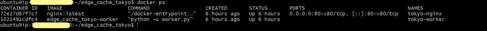
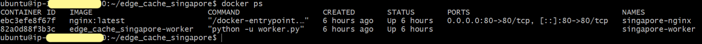
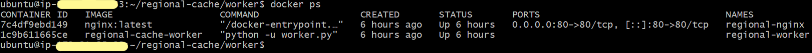

## Demonstration

### Route53 Latency-Based Routing

Route53 hosted zone `mk31.in` configured with two A records — `edge1` (`<TOKYO_PUBLIC_IP>`) and `edge2` (`<SINGAPORE_PUBLIC_IP>`) — using latency-based routing pointed at the Asia Pacific region. Requests resolve to the nearest edge based on network latency.


---

### ECS Cluster — cdn

Two Fargate services running in the `cdn` cluster, both active with 1/1 tasks running:

- `origin-api-service` — the FastAPI origin server
- `invalidation-service-service` — the SQS consumer / SNS publisher


---

### Application Load Balancer

`alb-sits-before-origin` — internet-facing ALB in `ap-south-1`, routing `HTTP:8000` traffic to the `origin-alb-tg` target group. Target `<ORIGIN_TASK_PRIVATE_IP>:8000` is **Healthy**.


---

### ECR — Docker Images

**origin-api** — 2 images stored, `latest` pushed by the CI pipeline on June 4, 2026.


**invalidation-service** — 3 images stored, `latest` is the most recently deployed version.


---

### GitHub Actions Deployments

Both workflows completed successfully. `Deploy Origin API` ran in 38s, `Deploy Invalidation Service` ran in 37s.


---

### nginx Default Page

Confirming nginx is running and serving on the edge/regional cache nodes.


---

### Edge Cache Nodes — Docker ps

**Tokyo edge (`<TOKYO_PUBLIC_IP>`):**

```
CONTAINER ID   IMAGE                    NAMES
72e27d87f7c7   nginx:latest             tokyo-nginx
5021491cdfc4   edge_cache_tokyo-worker  tokyo-worker
```



**Singapore edge (`<SINGAPORE_PUBLIC_IP>`):**

```
CONTAINER ID   IMAGE                        NAMES
ebc3efe8f67f   nginx:latest                 singapore-nginx
82a0d88f3b3c   edge_cache_singapore-worker  singapore-worker
```



**Regional cache (`<REGIONAL_PRIVATE_IP>`):**

```
CONTAINER ID   IMAGE                    NAMES
7c4df9ebd149   nginx:latest             regional-nginx
1c9b611665ce   regional-cache-worker    regional-worker
```



---

### Origin API — Swagger UI

The Origin API exposes a Swagger UI at `/docs`, reachable via the ALB DNS name (`<ALB_DNS_NAME>`) on port 8000.


---

### File Upload via Origin API

A file `later.txt` was uploaded using `POST /files/upload`. The API returned:

```json
{
  "message": "uploaded",
  "filename": "later.txt",
  "existing_file": false
}
```


---

### Regional Cache — MISS → HIT

First request: `X-Regional-Cache: MISS` — cache cold, proxied to origin.
Second request: `X-Regional-Cache: HIT` — served from regional nginx cache.

```bash
ubuntu@<REGIONAL_PRIVATE_IP>:~/regional-cache/worker$ curl -I http://localhost/files/later.txt
X-Layer: Regional
X-Regional-Cache: MISS

ubuntu@<REGIONAL_PRIVATE_IP>:~/regional-cache/worker$ curl -I http://localhost/files/later.txt
X-Layer: Regional
X-Regional-Cache: HIT
```


---

### Edge Cache Tokyo — MISS → HIT

First request through `mk31.in` resolved to Tokyo edge: regional cache was warm (`X-Regional-Cache: HIT`), but Tokyo edge was cold (`X-Edge-Cache: MISS`).
Second request: Tokyo edge now serves from its own local cache (`X-Edge-Cache: HIT`).

```bash
ubuntu@<TOKYO_PRIVATE_IP>:~/edge_cache_tokyo$ curl -I http://mk31.in/files/later.txt
X-Layer: Regional
X-Regional-Cache: HIT
X-Layer: Tokyo
X-Edge-Cache: MISS

ubuntu@<TOKYO_PRIVATE_IP>:~/edge_cache_tokyo$ curl -I http://mk31.in/files/later.txt
X-Layer: Regional
X-Regional-Cache: HIT
X-Layer: Tokyo
X-Edge-Cache: HIT
```


---

### Edge Cache Singapore — MISS → HIT

Singapore edge demonstrated independent caching for `yayaya.txt`. Regional cache was cold (MISS) on first request; Singapore edge cached it locally and returned HIT on second.

```bash
ubuntu@<SINGAPORE_PRIVATE_IP>:~/edge_cache_singapore$ curl -I http://mk31.in/files/yayaya.txt
X-Layer: Regional
X-Regional-Cache: MISS
X-Layer: Singapore
X-Singapore-Cache: MISS

ubuntu@<SINGAPORE_PRIVATE_IP>:~/edge_cache_singapore$ curl -I http://mk31.in/files/yayaya.txt
X-Layer: Regional
X-Regional-Cache: MISS
X-Layer: Singapore
X-Singapore-Cache: HIT
```


---

### Cache Invalidation — Delete Flow

File `no.txt` was deleted via `DELETE /files/no.txt` through the Origin API Swagger UI. Response:

```json
{
  "message": "deleted",
  "filename": "no.txt"
}
```


Following the delete, the regional cache correctly returns `404 Not Found` on both the first and second requests — confirming the invalidation worker processed the SQS message and purged the file from nginx cache.

```bash
ubuntu@<REGIONAL_PRIVATE_IP>:~/regional-cache/worker$ curl -I http://localhost/files/no.txt
HTTP/1.1 404 Not Found
X-Layer: Regional
X-Regional-Cache: MISS

ubuntu@<REGIONAL_PRIVATE_IP>:~/regional-cache/worker$ curl -I http://localhost/files/no.txt
HTTP/1.1 404 Not Found
X-Layer: Regional
X-Regional-Cache: MISS
```


> **Note:** 404 responses are intentionally not cached — every request for a deleted file hits upstream to confirm the file is truly gone.

---

### Invalidation Service Logs

The invalidation service ECS container logs confirm the full event lifecycle for `no.txt`:

```
Received: {'event_type': 'FILE_DELETED', 'filename': 'no.txt'}
Published to SNS
Deleted from queue
Polling...
```


---

### Origin API Logs

Origin API ECS container logs confirm the DELETE request was received and processed:

```
INFO: <ALB_HEALTH_CHECKER_IP> - "DELETE /files/no.txt HTTP/1.1" 200 OK
INFO: <ALB_HEALTH_CHECKER_IP> - "GET /files/no.txt HTTP/1.1" 404 Not Found
```

Health checks from the ALB (`GET /health`) are visible throughout, confirming the target remains healthy.


