## Demonstration

### Route53 Latency-Based Routing

Route53 hosted zone `mk31.in` configured with two A records — `edge1` (13.212.139.70) and `edge2` (13.115.254.210) — using latency-based routing pointed at the Asia Pacific region. Requests resolve to the nearest edge based on network latency.

<!-- INSERT SCREENSHOT: Route53 hosted zone showing mk31.in with A records (edge1 and edge2), NS, and SOA records -->
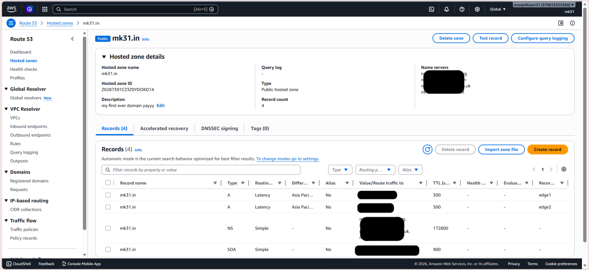

---

### ECS Cluster — cdn

Two Fargate services running in the `cdn` cluster, both active with 1/1 tasks running:

- `origin-api-service` — the FastAPI origin server
- `invalidation-service-service` — the SQS consumer / SNS publisher

<!-- INSERT SCREENSHOT: ECS cluster showing 2 active services, 2 running tasks -->
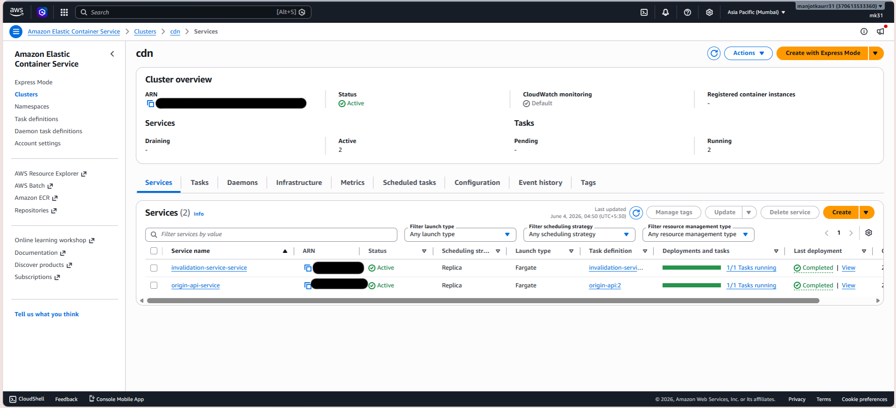

---

### Application Load Balancer

`alb-sits-before-origin` — internet-facing ALB in `ap-south-1`, routing `HTTP:8000` traffic to the `origin-alb-tg` target group. Target `172.31.5.244:8000` is **Healthy**.

<!-- INSERT SCREENSHOT: ALB resource map showing listener → target group → healthy ECS task target -->
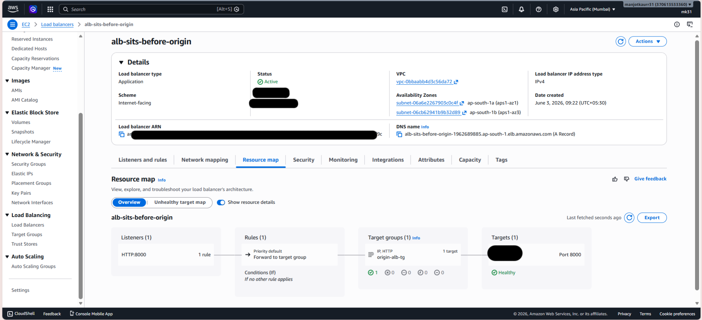

---

### ECR — Docker Images

**origin-api** — 2 images stored, `latest` pushed by the CI pipeline on June 4, 2026.

<!-- INSERT SCREENSHOT: ECR origin-api repository showing 2 images with latest tag -->
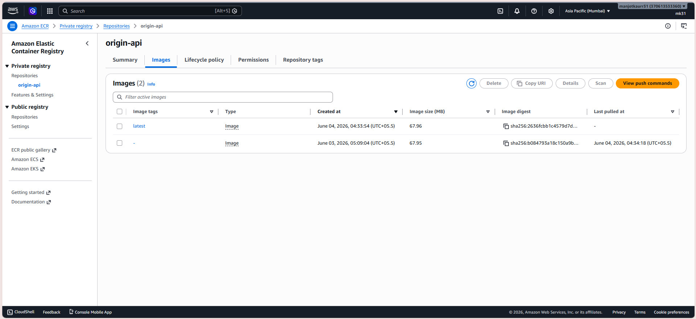

**invalidation-service** — 3 images stored, `latest` is the most recently deployed version.

<!-- INSERT SCREENSHOT: ECR invalidation-service repository showing 3 images -->
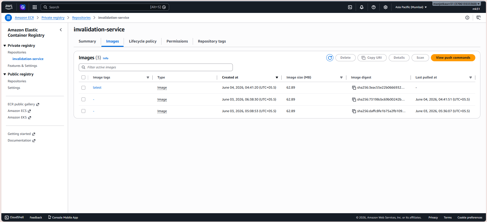

---

### GitHub Actions Deployments

Both workflows completed successfully. `Deploy Origin API` ran in 38s, `Deploy Invalidation Service` ran in 37s.

<!-- INSERT SCREENSHOT: GitHub Actions showing 2 completed workflow runs -->
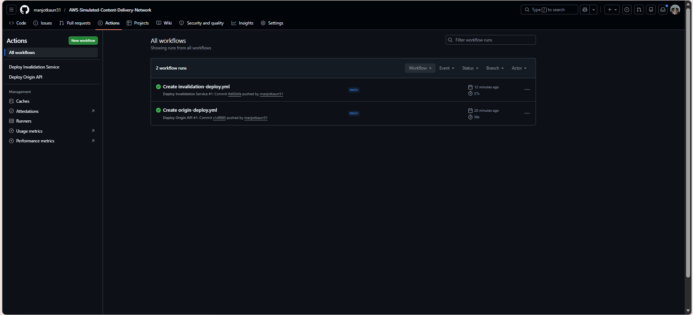

---

### nginx Default Page

Confirming nginx is running and serving on the edge/regional cache nodes.

<!-- INSERT SCREENSHOT: nginx welcome page -->
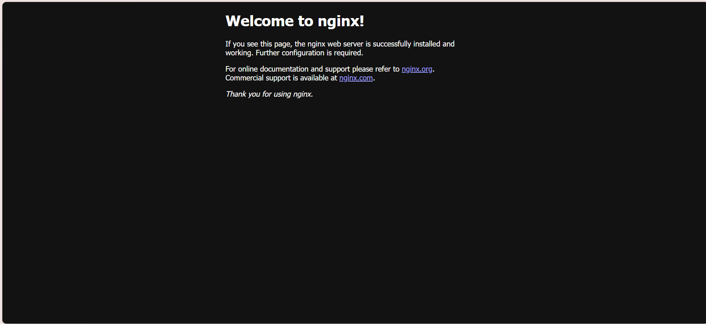

---

### Edge Cache Nodes — Docker ps

**Tokyo edge:**

```
CONTAINER ID   IMAGE                    NAMES
72e27d87f7c7   nginx:latest             tokyo-nginx
5021491cdfc4   edge_cache_tokyo-worker  tokyo-worker
```

**Singapore edge:**

```
CONTAINER ID   IMAGE                        NAMES
ebc3efe8f67f   nginx:latest                 singapore-nginx
82a0d88f3b3c   edge_cache_singapore-worker  singapore-worker
```

**Regional cache:**

```
CONTAINER ID   IMAGE                    NAMES
7c4df9ebd149   nginx:latest             regional-nginx
1c9b611665ce   regional-cache-worker    regional-worker
```

<!-- INSERT SCREENSHOT: docker ps output from regional cache node -->
<!-- INSERT SCREENSHOT: docker ps output from Tokyo edge node -->
<!-- INSERT SCREENSHOT: docker ps output from Singapore edge node -->

---

### Origin API — Swagger UI

The Origin API exposes a Swagger UI at `/docs`, reachable via the ALB DNS name on port 8000.

<!-- INSERT SCREENSHOT: Swagger UI showing all endpoints -->
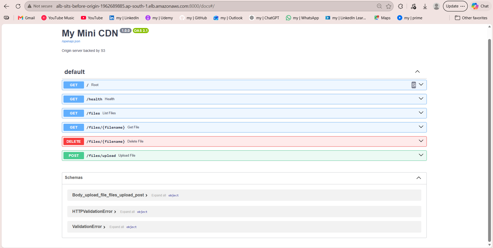

---

### File Upload via Origin API

A file `later.txt` was uploaded using `POST /files/upload`. The API returned:

```json
{
  "message": "uploaded",
  "filename": "later.txt",
  "existing_file": false
}
```

<!-- INSERT SCREENSHOT: Swagger POST /files/upload with 200 response -->
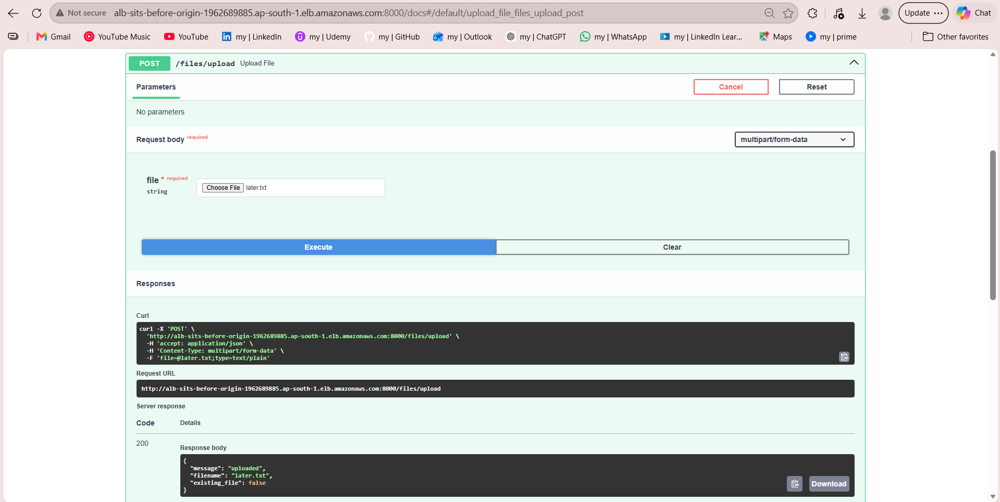

---

### Regional Cache — MISS → HIT

First request: `X-Regional-Cache: MISS` — cache cold, proxied to origin.
Second request: `X-Regional-Cache: HIT` — served from regional nginx cache.

```bash
$ curl -I http://localhost/files/later.txt
X-Layer: Regional
X-Regional-Cache: MISS

$ curl -I http://localhost/files/later.txt
X-Layer: Regional
X-Regional-Cache: HIT
```

<!-- INSERT SCREENSHOT: terminal showing regional cache MISS then HIT headers -->
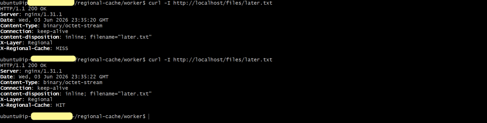

---

### Edge Cache Tokyo — MISS → HIT

First request through `mk31.in` resolved to Tokyo edge: regional cache was warm (`X-Regional-Cache: HIT`), but Tokyo edge was cold (`X-Edge-Cache: MISS`).
Second request: Tokyo edge now serves from its own local cache (`X-Edge-Cache: HIT`).

```bash
$ curl -I http://mk31.in/files/later.txt
X-Layer: Regional
X-Regional-Cache: HIT
X-Layer: Tokyo
X-Edge-Cache: MISS

$ curl -I http://mk31.in/files/later.txt
X-Layer: Regional
X-Regional-Cache: HIT
X-Layer: Tokyo
X-Edge-Cache: HIT
```

<!-- INSERT SCREENSHOT: terminal showing Tokyo edge MISS then HIT -->
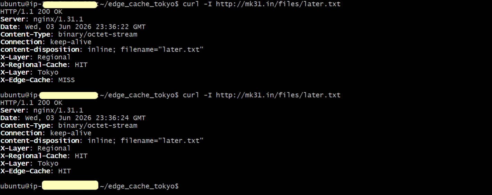

---

### Edge Cache Singapore — MISS → HIT

Singapore edge demonstrated independent caching for `yayaya.txt`. Regional cache was cold (MISS) on first request; Singapore edge cached it locally and returned HIT on second.

```bash
$ curl -I http://mk31.in/files/yayaya.txt
X-Layer: Regional
X-Regional-Cache: MISS
X-Layer: Singapore
X-Singapore-Cache: MISS

$ curl -I http://mk31.in/files/yayaya.txt
X-Layer: Regional
X-Regional-Cache: MISS
X-Layer: Singapore
X-Singapore-Cache: HIT
```

<!-- INSERT SCREENSHOT: terminal showing Singapore edge MISS then HIT -->
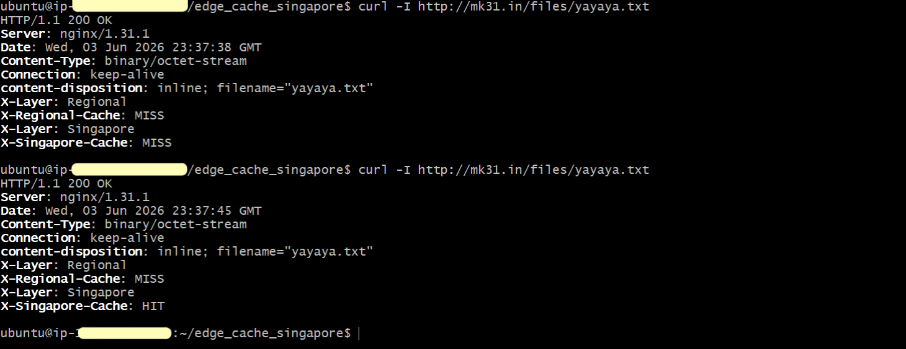

---

### Cache Invalidation — Delete Flow

File `no.txt` was deleted via `DELETE /files/no.txt` through the Origin API Swagger UI. Response:

```json
{
  "message": "deleted",
  "filename": "no.txt"
}
```

Following the delete, the regional cache correctly returns `404 Not Found` on both the first and second requests — confirming the invalidation worker processed the SQS message and purged the file from nginx cache.

```bash
$ curl -I http://localhost/files/no.txt
HTTP/1.1 404 Not Found
X-Layer: Regional
X-Regional-Cache: MISS

$ curl -I http://localhost/files/no.txt
HTTP/1.1 404 Not Found
X-Layer: Regional
X-Regional-Cache: MISS
```

Note: 404 responses are intentionally not cached — every request for a deleted file hits upstream to confirm the file is truly gone.

<!-- INSERT SCREENSHOT: Swagger DELETE /files/no.txt showing 200 deleted response -->
<!-- INSERT SCREENSHOT: terminal showing regional cache returning 404 after invalidation -->
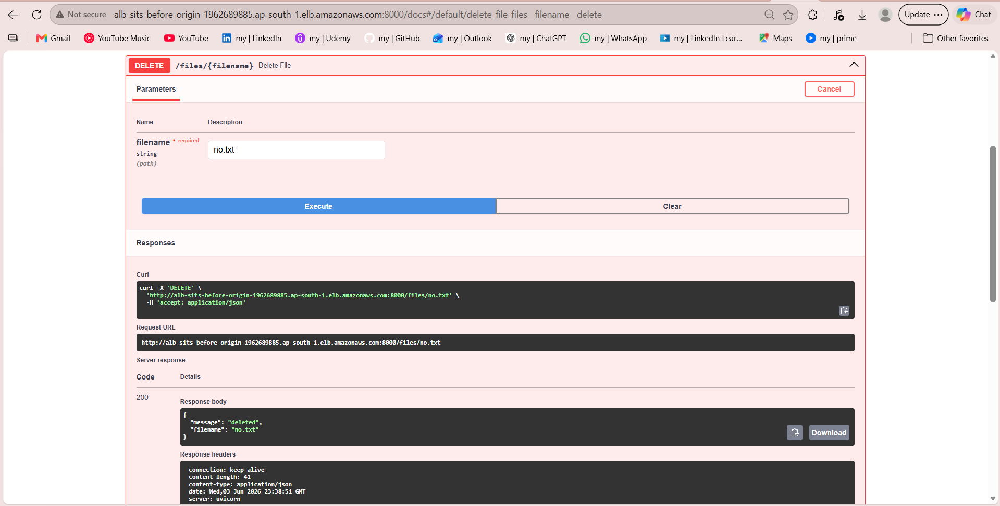
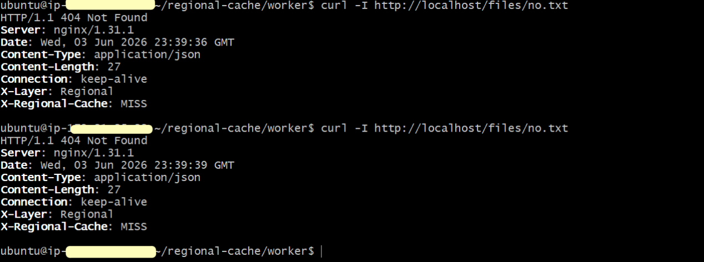

---

### Invalidation Service Logs

The invalidation service ECS container logs confirm the full event lifecycle for `no.txt`:

```
Received: {'event_type': 'FILE_DELETED', 'filename': 'no.txt'}
Published to SNS
Deleted from queue
Polling...
```

<!-- INSERT SCREENSHOT: ECS task logs for invalidation-service-container showing the FILE_DELETED event -->
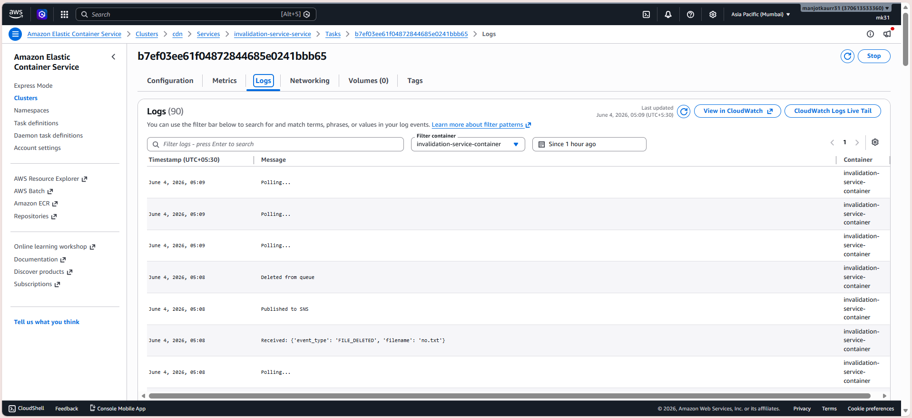

---

### Origin API Logs

Origin API ECS container logs confirm the DELETE request was received and processed:

```
INFO: DELETE /files/no.txt HTTP/1.1  200 OK
INFO: GET /files/no.txt HTTP/1.1     404 Not Found
```

Health checks from the ALB (`GET /health`) are visible throughout, confirming the target remains healthy.

<!-- INSERT SCREENSHOT: ECS task logs for origin-api container showing DELETE and subsequent 404 GETs -->
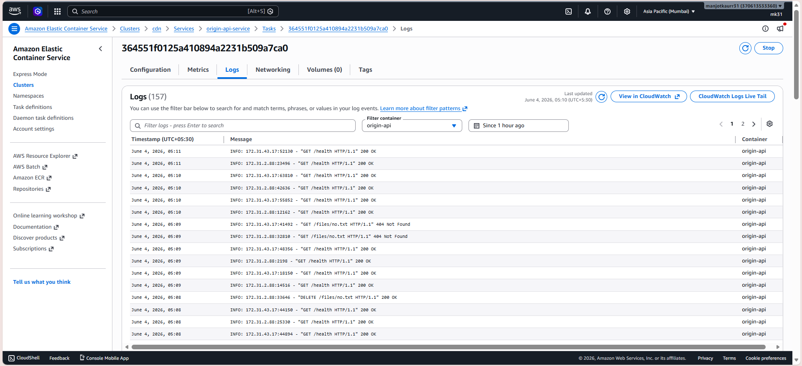

---
