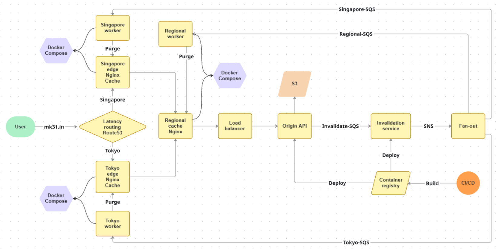

# Multi-Region CDN with Event-Driven Cache Invalidation on AWS

> A production-grade, simulated Content Delivery Network built entirely on AWS — featuring multi-layer caching, latency-based routing, containerized microservices, and fully automated cache invalidation via SNS/SQS fan-out.

---

## Table of Contents

- [Overview](#overview)
- [Architecture](#architecture)
  - [Request Flow](#request-flow)
  - [Invalidation Flow](#invalidation-flow)
- [AWS Services Used](#aws-services-used)
- [Repository Structure](#repository-structure)
- [Components](#components)
  - [Origin API](#origin-api)
  - [Invalidation Service](#invalidation-service)
  - [Regional Cache](#regional-cache)
  - [Edge Caches](#edge-caches)
- [CI/CD Pipeline](#cicd-pipeline)
- [Key Learnings](#key-learnings)
- [Future Improvements](#future-improvements)

---

## Overview

This project simulates a real-world multi-layer CDN on AWS. It was built to deeply understand how content delivery networks actually work under the hood — including how cache hierarchies are structured, how cache invalidation propagates across distributed nodes, and how event-driven architectures decouple producers from consumers at scale.

The system consists of:

- **Edge caches** deployed in multiple AWS regions (Tokyo, Singapore) to serve users with low latency
- **A regional cache** as an intermediate caching layer between edge nodes and origin
- **An Origin API** running on ECS Fargate, backed by S3, serving as the source of truth
- **An Invalidation Service** running on ECS Fargate that consumes file-deletion events and fans them out via SNS/SQS to all cache nodes
- **Route53 latency-based routing** to direct users to the geographically nearest edge
- **An Application Load Balancer** providing a stable endpoint for the origin, decoupled from ECS task lifecycle
- **GitHub Actions CI/CD** automating Docker builds, ECR pushes, and ECS deployments

---

## Architecture



### Request Flow

```
User Request
     │
     ▼
Route53 (Latency-Based Routing)
     │
     ├──────────────────┐
     ▼                  ▼
Singapore Edge      Tokyo Edge
Cache (nginx)       Cache (nginx)
     │                  │
     └────────┬─────────┘
              ▼
       Regional Cache
         (nginx)
              │
              ▼
  Application Load Balancer
   (alb-sits-before-origin)
              │
              ▼
     Origin API (ECS Fargate)
       FastAPI + S3 Backend
```

On the **first request** (cache MISS), the edge cache forwards to the regional cache, which forwards to the ALB, which routes to the Origin API on ECS. Responses are cached at each layer. On **subsequent requests** (cache HIT), responses are served directly from the nearest cache layer — no upstream traffic.

Custom response headers expose cache state at each layer:

| Header | Values | Layer |
|---|---|---|
| `X-Layer` | `Regional` | Regional cache |
| `X-Regional-Cache` | `HIT` / `MISS` | Regional cache |
| `X-Layer` | `Tokyo` / `Singapore` | Edge cache |
| `X-Edge-Cache` | `HIT` / `MISS` | Edge cache |
| `X-Tokyo-Cache` | `HIT` / `MISS` | Tokyo edge |
| `X-Singapore-Cache` | `HIT` / `MISS` | Singapore edge |

### Invalidation Flow

When a file is deleted from the Origin API, the system automatically propagates the invalidation to every cache node:

```
Origin API (DELETE /files/{filename})
     │
     ▼
SQS — Origin Events Queue
     │
     ▼
Invalidation Service (ECS Fargate)
  Polls SQS, processes FILE_DELETED events
     │
     ▼
SNS Topic (fan-out)
     │
     ├──────────────────┬──────────────────┐
     ▼                  ▼                  ▼
  SQS Queue         SQS Queue         SQS Queue
  (Tokyo)          (Singapore)        (Regional)
     │                  │                  │
     ▼                  ▼                  ▼
Tokyo Worker      Singapore Worker   Regional Worker
  Purges cache      Purges cache       Purges cache
```

Deleted files return `404 Not Found` from all cache layers automatically — no manual cache flushing required.

---

## AWS Services Used

| Service | Purpose |
|---|---|
| **ECS Fargate** | Runs Origin API and Invalidation Service as containerized tasks, serverless |
| **ECR** | Private Docker image registry for `origin-api` and `invalidation-service` |
| **Route53** | Latency-based DNS routing to direct users to nearest edge cache |
| **ALB** | Application Load Balancer providing stable origin endpoint, decoupled from ECS task IPs |
| **SQS** | Decouples origin from invalidation service; also used per-region for fan-out |
| **SNS** | Fan-out distribution of invalidation events to all regional SQS queues simultaneously |
| **EC2** | Hosts regional cache and edge cache nodes (nginx + Python worker) |
| **S3** | Backend storage for Origin API file content |
| **IAM** | Fine-grained roles for ECS tasks, EC2 instances, and GitHub Actions |
| **CloudWatch** | Container logs and metrics for ECS tasks |

---

## Repository Structure

```
AWS-Simulated-Content-Delivery-Network/
├── .github/
│   └── workflows/
│       ├── origin-deploy.yml          # CI/CD: build & deploy Origin API
│       └── invalidation-deploy.yml    # CI/CD: build & deploy Invalidation Service
│
├── origin/                            # FastAPI Origin API (ECS Fargate)
│
├── invalidation-service/              # SQS consumer + SNS publisher (ECS Fargate)
│
├── regional-cache/
│   └── worker/                        # nginx config + Python cache worker
│
├── edge_cache_singapore/              # Singapore edge: nginx + Python worker
│
├── edge_cache_tokyo/                  # Tokyo edge: nginx + Python worker
│
├── .gitignore
└── README.md
```

---

## Components

### Origin API

The Origin API is a **FastAPI** application running on **ECS Fargate**, backed by **Amazon S3** for file storage.

**Endpoints:**

| Method | Path | Description |
|---|---|---|
| `GET` | `/` | Root / health check |
| `GET` | `/health` | Health probe (used by ALB target group) |
| `GET` | `/files` | List all stored files |
| `GET` | `/files/{filename}` | Retrieve a file |
| `DELETE` | `/files/{filename}` | Delete a file + publish invalidation event to SQS |
| `POST` | `/files/upload` | Upload a file to S3 |

On every `DELETE`, the Origin API publishes a structured event to SQS:

```json
{
  "event_type": "FILE_DELETED",
  "filename": "example.txt"
}
```

The Origin API is fronted by the **Application Load Balancer** (`alb-sits-before-origin`) listening on port 8000. The ALB provides a stable DNS endpoint so that cache nodes and the invalidation service never need to track ECS task IPs directly.

**Location:** `origin/`

---

### Invalidation Service

A Python worker running on **ECS Fargate** that bridges the origin and the edge caches.

**Responsibilities:**
- Long-polls the **Origin Events SQS queue** for new messages
- On receiving a `FILE_DELETED` event, publishes to an **SNS Topic**
- SNS fans the message out to subscribed SQS queues (one per region: Tokyo, Singapore, Regional)
- Each regional worker independently processes its queue and purges the stale file from nginx cache

This design means the Origin API never needs to know about or communicate directly with any cache node — full decoupling.

**Location:** `invalidation-service/`

---

### Regional Cache

The regional cache is an **EC2 instance** running two Docker containers:

- **nginx** — reverse proxy with proxy caching enabled, listening on port 80
- **regional-worker** — Python process that polls a regional SQS queue and issues cache purge commands to nginx

**Cache behaviour:**
- Adds `X-Layer: Regional` and `X-Regional-Cache: HIT/MISS` headers to responses
- On MISS: proxies upstream to the ALB origin endpoint
- On subsequent requests: serves directly from nginx's local disk cache
- On invalidation: worker receives SQS message and purges the cached object

**Location:** `regional-cache/`

---

### Edge Caches

Two **EC2 instances**, one per geographic region, each running:

- **nginx** — caching reverse proxy, listening on port 80
- **edge-worker** — Python process consuming from a region-specific SQS queue

**Regions deployed:**
- `edge_cache_tokyo` — AP Northeast (Tokyo)
- `edge_cache_singapore` — AP Southeast (Singapore)

**Cache behaviour:**
- Adds region-specific headers: `X-Layer: Tokyo` / `X-Layer: Singapore` and `X-Edge-Cache: HIT/MISS`
- On MISS: proxies upstream to the **regional cache** (not directly to origin)
- On HIT: serves from local nginx cache
- On invalidation: worker purges file locally

Both edges register as A records in **Route53** with latency-based routing, so users are automatically directed to whichever edge is geographically closest.

**Locations:** `edge_cache_tokyo/`, `edge_cache_singapore/`

---

## CI/CD Pipeline

Two GitHub Actions workflows automate the full deploy pipeline for containerized services:

```
Git Push to main
      │
      ▼
GitHub Actions Triggered
      │
      ▼
Docker Build (from Dockerfile)
      │
      ▼
docker tag :latest
      │
      ▼
docker push → Amazon ECR
(origin-api / invalidation-service)
      │
      ▼
aws ecs update-service --force-new-deployment
      │
      ▼
ECS pulls new image from ECR
      │
      ▼
New tasks start, old tasks drain
      │
      ▼
Service running updated version
```

Automated for:
- `origin-api` ECS service
- `invalidation-service-service` ECS service

Edge and regional caches are EC2-based and not included in the automated pipeline (manual deploy or future Terraform/Ansible target).

---

## Key Learnings

**Multi-layer CDN architecture** — Understanding how edge → regional → origin hierarchies reduce latency and origin load. Each layer has independent TTL and cache state.

**Event-driven cache invalidation** — The hardest problem in caching is knowing when to invalidate. Using SQS + SNS completely decouples the origin from cache nodes: origin publishes an event once, and every subscribed node independently processes it.

**SNS fan-out pattern** — A single SNS publish reaches N SQS queues simultaneously. Adding a new cache region requires only subscribing a new SQS queue to the topic — no changes to origin or invalidation service.

**Application Load Balancer for stable service discovery** — ECS task IPs change on every deployment. Placing an ALB in front of ECS means all downstream consumers (cache workers, monitoring) use a stable DNS name that never changes.

**ECS Fargate for operational simplicity** — No EC2 instance management for containerized services. ECS handles scheduling, health checking, and rolling deploys.

**Nginx proxy caching** — Configuring nginx as a caching reverse proxy with `proxy_cache_path`, `proxy_cache_key`, and `proxy_cache_valid` directives. Cache purging via the `ngx_cache_purge` module (or cache path removal).

**Custom response headers for observability** — Adding `X-Layer`, `X-Regional-Cache`, `X-Edge-Cache` headers lets you instantly see from a `curl -I` which layer served the response and whether it was a cache hit.

**GitHub Actions for container CI/CD** — Automating the build → tag → ECR push → ECS force-deploy cycle. Secrets managed via GitHub repository secrets.

---

## Future Improvements

- **HTTPS** — Add ACM certificates and HTTPS listeners on the ALB and edge nginx configs
- **CloudFront integration** — Replace EC2 edge nodes with CloudFront distributions for global coverage and managed SSL
- **Auto Scaling** — Add ECS service auto scaling policies and EC2 ASGs for cache nodes based on CPU/request metrics
- **Infrastructure as Code** — Replace manual AWS console setup with Terraform modules covering VPC, ECS, ALB, Route53, SQS, SNS, and EC2
- **GitHub Actions for cache nodes** — Extend CI/CD to automate cache node deployments via Ansible or SSM Run Command
- **CloudWatch dashboards** — Build dashboards tracking cache hit rates, origin request volume, invalidation latency, and ECS task health
- **Cache stampede protection** — Add request coalescing at the regional cache to prevent thundering herd on cold cache

---

Lastly, take a look at `Demonstration.md` to understand **project implementation** and **CDN mechanism** better!
